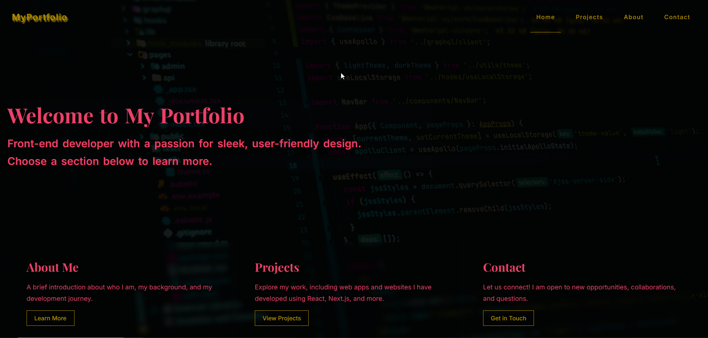
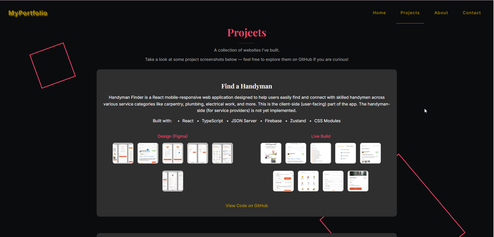
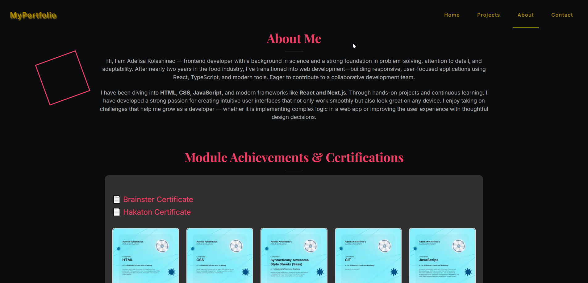
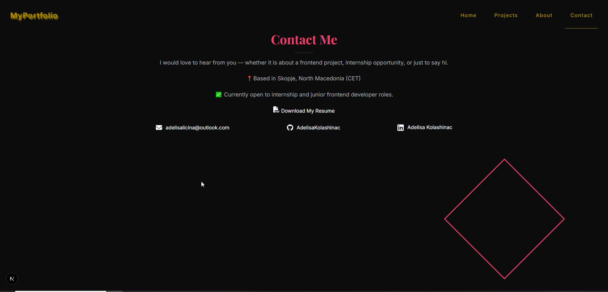

# 💼 Adelisa Kolashinac – Portfolio Website

Welcome to my personal portfolio website! This site showcases who I am, the projects I've worked on, and the skills I’ve developed in frontend development.

---

## 🌐 Live Site

[https://adelisa-portfolio.netlify.app](https://adelisa-portfolio.netlify.app)

---

## ✨ Features

- **About Me Page** – A brief introduction about who I am and what I do.
- **Projects Page** – A collection of my projects with:
  - Screenshots for visual preview  
  - Links to the GitHub repositories for each project.
- **Contact Page** – Direct links to my email, GitHub, and LinkedIn.
- **Responsive Design** – Looks great on desktop, tablet, and mobile devices.
- **Clean and Minimal UI** – Focused on content and readability.

---

## 🛠️ Tech Stack

- **Next.js**
- **TypeScript**
- **CSS Modules**

---

## 🖼️ Screenshots

### 🧑‍💻 Home Page


### 🧑‍💻 About Me Page


### 📁 Projects Page


### 📬 Contact Page


---

## 🚀 Getting Started (for Devs)

If you'd like to run this project locally:

```bash
git clone https://github.com/AdelisaKolashinac/my-portfolio.git
cd my-portfolio
npm install
npm run dev

---

## 🔖 License

This project is licensed under the [MIT License](./LICENSE).

---

📬 Contact

Email: adelisalicina@outlook.com
GitHub: AdelisaKolashinac
